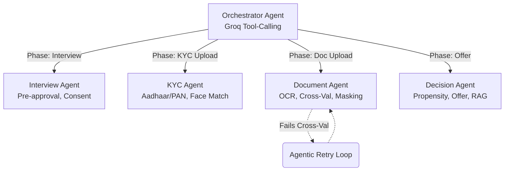

<div align="center">

# 🎥 Vantage AI — AI-Powered Video Loan Origination System

**Real-time KYC · Agentic Workflow · RBI-Compliant · Multilingual**

[](https://pfrda.org.in)
[](https://python.org)
[](https://nextjs.org)
[](https://groq.com)

> **Vantage AI** is a production-grade, end-to-end AI-powered loan origination platform that replaces traditional in-branch KYC with a 5-minute live video call. An AI agent conducts the interview, verifies identity documents via OCR and Aadhaar checksum, detects fraud in real-time, and generates instant pre-approved loan offers — all fully compliant with RBI V-CIP and KYC Master Direction 2016.

</div>

---

## 📑 Table of Contents
1. [🎯 What is Vantage AI?](#-what-is-vantage-ai)
2. [🌟 Key Features](#-key-features)
3. [🏗️ System & Multi-Agent Architecture](#-system--multi-agent-architecture)
4. [🛠️ Tech Stack](#️-tech-stack)
5. [🔄 User Flow](#-user-flow)
6. [🏛️ RBI & Regulatory Compliance](#️-rbi--regulatory-compliance)
7. [📡 API Reference](#-api-reference)
8. [🚀 Setup & Installation](#-setup--installation)

---

## 🎯 What is Vantage AI?

Traditional loan origination requires physical branch visits, manual document verification (taking days), human agents asking repetitive questions, and paper-based consent trails. 

**Vantage AI** replaces this with:
- **AI-powered video KYC** via a live webcam call
- **Real-time speech-to-text** (Deepgram) for natural conversation
- **LLM-based interview agent** (Groq Llama 3.3 70B) that adapts to the customer
- **Instant OCR document verification** with cross-validation
- **Multi-agent orchestration** for modular, auditable decisions
- **Regulatory-compliant audit trails** with RBI policy RAG citations

---

## 🌟 Key Features

| Feature | Description |
| :--- | :--- |
| 🎙️ **Live AI Interview** | Llama 3.3 70B conducts a conversational interview, extracting profile data seamlessly. |
| 🗣️ **Real-time STT & TTS** | Deepgram Nova-2 STT with Web Speech API TTS for native English, Hindi, and Marathi interactions. |
| 📄 **Intelligent OCR** | Groq Vision extracts fields from Aadhaar, PAN, and address proofs, running Verhoeff checksums. |
| 🔍 **Cross-Validation** | Consistency checks across matched documents with **Agentic Document Retry** for smart error recovery. |
| 👤 **Face Match** | Selfie captured from video call matched against document photo and age estimation. |
| 🛡️ **Risk & Compliance** | Sanctions screening (UNSC/UAPA), Geo-tagging (V-CIP), Aadhaar Masking, and Bureau/Propensity Scoring. |
| 🏛️ **RBI Policy RAG** | ChromaDB semantic search over the **RBI KYC Master Direction 2016** attached to every automated decision. |
| 🧑‍💼 **Admin & Analytics** | JWT-authenticated portal with Human Review Escalation Queues and **NL→SQL AI Analytics Chatbot**. |

---

## 🏗️ System & Multi-Agent Architecture

Vantage AI is orchestrated by a **Multi-Agent System**. Instead of a single massive prompt, an Orchestrator Agent analyzes the user's state and routes tasks to specialized sub-agents. 


*Note: A PolicyRAGAgent specifically handles compliance querying across all stages.*

---

## 🛠️ Tech Stack

### Core Layers
- **Backend**: Python 3.11+, FastAPI, Uvicorn, SQLite
- **Frontend**: Next.js 16 (App Router), React 19, Tailwind CSS 4, Framer Motion
- **AI & ML**: Groq SDK (Llama 3.3 70B, Llama 4 Scout), DeepFace (Age), ChromaDB, sentence-transformers
- **Integrations**: Deepgram (Live STT WebSocket), Daily.co (Video Rooms), Nominatim OSM, GST API

---

## 🔄 User Flow 

1. **Multilingual Onboarding**: User selects language (EN/HI/MR) and verifies OTP. Accepts mandatory DPDPA consents.
2. **Video Call**: Live AI interview handles data collection and verbal consent (RBI V-CIP).
3. **KYC Upload**: Aadhaar and PAN undergo OCR validation, face-match processing, and format verifications.
4. **Document Sync**: Address proofs and loan-specific docs are cross-validated. The Agent uses a **3-try retry loop** for issues before human escalation.
5. **Final Decision**: Risk rules + Propensity models run. Instant EMI calculation and offer generation displayed on a smart dashboard.

---

## 🏛️ RBI & Regulatory Compliance
We mapped the platform directly to Indian financial regulations:
- **RBI KYC Master Direction 2016**: RAG instances validate procedures (e.g. `RBI_KYC_2016_S3_OVD`).
- **V-CIP**: Mandatory video capture, randomized liveliness tests, geo-tagging, matched audio-visuals.
- **DPDPA 2023**: Granular user consent logs preserved securely in SQLite.
- **UIDAI**: Aadhaar Verhoeff checksums and explicit 8-digit data masking.
- **UAPA Section 51A**: Real-time screening against designated sanctions lists.

---

## 📡 API Reference

**Core REST endpoints exposed by FastAPI (`:8001`)**:
- `POST /api/agent/orchestrate`: Primary entry point for multi-agent state progression.
- `POST /api/send-otp` & `/api/verify-otp`: User authentication.
- `POST /api/create-room`: Setup WebRTC sessions.
- `POST /api/interview/preapprove`: LLM interview processing.
- `POST /api/kyc/verify-documents`: OCR parsing and visual validation.
- `POST /api/log-session`: End-of-flow immutable DPDPA audit logging.

*Admin secured APIs under `/api/admin/*` require JWT matching the Role-Based Access Control logic.*

---

## 🚀 Setup & Installation

### Prerequisites
- Python 3.11+
- Node.js 18+

### 1. Environment Variables
Create a `.env` in the `backend/` root:
```env
DAILY_API_KEY=your_daily_co_api_key_here
DEEPGRAM_API_KEY=your_deepgram_api_key_here
GROQ_API_KEY=your_groq_api_key_here
```
Create a `.env.local` in `frontend/`:
```env
NEXT_PUBLIC_BACKEND_URL=http://127.0.0.1:8001
```

### 2. Backend Setup
```bash
git clone https://github.com/<your-org>/<your-repo>.git
cd backend

python -m venv venv
source venv/bin/activate  # Windows: venv\Scripts\activate
pip install -r requirements.txt

python main.py  # Runs on http://127.0.0.1:8001
```

### 3. Frontend Setup
```bash
cd ../frontend
npm install
npm run dev  # Runs on http://localhost:3000
```

### 4. Admin Access
Navigate to `http://localhost:3000/admin`. 
Demo Credentials:
- **User**: `officer`, **Pass**: `officer123`

---
<div align="center">
  <b>Built with ❤️ by Team TenzorX for the Poonawalla Fincorp Hackathon 2026.</b>
</div>
