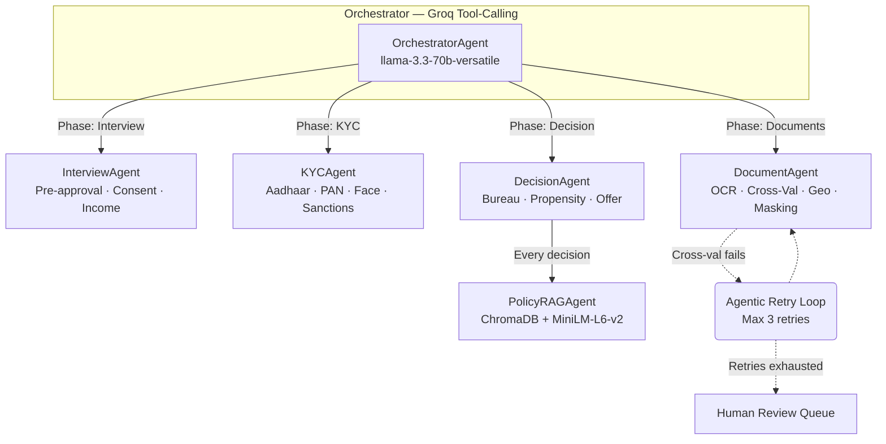

<div align="center">

# 🎥 Vantage AI — AI-Powered Video Loan Origination System

**Real-time KYC · Agentic Workflow · RBI-Compliant · Multilingual**

[](https://pfrda.org.in)
[](https://python.org)
[](https://nextjs.org)
[](https://groq.com)

> **Vantage AI** is a production-grade, end-to-end AI-powered loan origination platform that replaces traditional in-branch KYC with a 5-minute live video call. An AI agent conducts the interview, verifies identity documents via OCR and Aadhaar checksum, detects fraud in real-time, and generates instant pre-approved loan offers — all fully compliant with RBI V-CIP and KYC Master Direction 2016.

</div>

---

## 📑 Table of Contents
1. [🎯 What is Vantage AI?](#-what-is-vantage-ai)
2. [🌟 Key Features](#-key-features)
3. [🏗️ System & Multi-Agent Architecture](#️-system--multi-agent-architecture)
4. [🛠️ Tech Stack](#️-tech-stack)
5. [📁 Project Structure](#-project-structure)
6. [🔄 User Flow](#-user-flow)
7. [🤖 Multi-Agent Orchestration](#-multi-agent-orchestration)
8. [🏛️ RBI & Regulatory Compliance](#️-rbi--regulatory-compliance)
9. [🔐 Security & PII Protection](#-security--pii-protection)
10. [📡 API Reference](#-api-reference)
11. [🖥️ Frontend Pages](#️-frontend-pages)
12. [🌐 Multilingual Support](#-multilingual-support)
13. [🚀 Setup & Installation](#-setup--installation)

---

## 🎯 What is Vantage AI?

Traditional loan origination requires physical branch visits, manual document verification (taking days), human agents asking repetitive questions, and paper-based consent trails. 

**Vantage AI** replaces this with:
- **AI-powered video KYC** via a live webcam call
- **Real-time speech-to-text** (Deepgram Nova-2) for natural conversation
- **LLM-based interview agent** (Groq Llama 3.3 70B) that adapts to the customer
- **Instant OCR document verification** with cross-validation using Llama 4 Scout Vision
- **Multi-agent orchestration** for modular, auditable decisions
- **Regulatory-compliant audit trails** with RBI policy RAG citations
- **Automated human escalation** queue for high-risk cases

---

## 🌟 Key Features

| Feature | Description |
| :--- | :--- |
| 🎙️ **Live AI Interview** | Llama 3.3 70B conducts a conversational interview in EN, HI, or MR — extracting profile data seamlessly across 7 structured questions. |
| 🗣️ **Real-time STT & TTS** | Deepgram Nova-2 live WebSocket STT with Web Speech API TTS for native English, Hindi, and Marathi interactions. |
| 📄 **Intelligent OCR** | Llama 4 Scout 17B Vision extracts structured fields from Aadhaar, PAN, and address proofs via Groq Vision API. |
| 🔍 **Cross-Validation** | Consistency checks across documents (name, DOB, gender, address) with **Agentic Document Retry Loop** — max 3 retries before human escalation. |
| 👤 **Face Match & Liveness** | Selfie matched against document photo, DeepFace age estimation (multi-frame median), and emotion-based liveness detection. |
| 🛡️ **Risk & Compliance** | Sanctions screening (UNSC/UAPA), geo-tagging (V-CIP), Aadhaar masking, bureau scoring, propensity modeling, and 6 fraud check categories. |
| 🏛️ **RBI Policy RAG** | ChromaDB + MiniLM-L6-v2 semantic search over the **RBI KYC Master Direction 2016** — regulatory citations attached to every automated decision. |
| 🧑‍💼 **Admin Portal** | JWT-authenticated dashboard with session viewer, human review queue (7 escalation triggers), analytics panels, and **NL→SQL AI Analytics Chatbot**. |
| 🔐 **PII Protection** | SHA-256 salted hashing of all phone, Aadhaar, and PAN numbers before persistence. Raw PII is never stored. |
| 📋 **DPDPA Consent** | Granular consent recording (VIDEO_RECORDING, DATA_PROCESSING, KYC_VERIFICATION) with timestamps, versions, and IP logging. |
| 📊 **Document Generation** | Auto-filled loan application forms in HTML and downloadable PDF via ReportLab. |
| ✅ **Verification Registry** | Unified Aadhaar (format + Verhoeff + QR + e-KYC), PAN (format + name), and GST (real government API) verification interface. |

---

## 🏗️ System & Multi-Agent Architecture

Vantage AI is orchestrated by a **Multi-Agent System**. Instead of a single massive prompt, an Orchestrator Agent uses **Groq tool-calling** to analyze the user's state and route tasks to specialized sub-agents.



### Phase Transitions
```
interview → kyc → document → decision → complete
                      ↑          |
                      └──────────┘  (agentic retry loop on cross-validation failure)
```

### Agent Tool Registries

| Agent | Tools | Regulatory Tags |
|:------|:------|:---------------|
| **InterviewAgent** | `calculate_preapproval`, `validate_consent`, `detect_income_inconsistency` | RBI_KYC_2016_CH5, VCIP_CONSENT |
| **KYCAgent** | `verify_aadhaar_format`, `verhoeff_checksum`, `face_match`, `check_sanctions_list` | RBI_KYC_2016_S3_OVD, UIDAI_VERHOEFF, VCIP_FACE_MATCH, UAPA_51A |
| **DocumentAgent** | `ocr_document`, `cross_validate_fields`, `geolocate_and_match`, `mask_aadhaar_number` | RBI_KYC_2016_CH6_CDD, VCIP_GEO_TAGGING, RBI_AADHAAR_MASKING |
| **DecisionAgent** | `bureau_score`, `propensity_score`, `generate_offer`, `query_rbi_policy_rag` | RBI_KYC_2016_CH4_RISK, RBI_KYC_2016_RAG |
| **PolicyRAGAgent** | `query(text, top_k)` — semantic search over RBI KYC 2016 | RBI_KYC_2016_RAG |

---

## 🛠️ Tech Stack

### Backend
| Component | Technology |
|:----------|:-----------|
| API Framework | FastAPI + Uvicorn |
| LLM (Interview/Orchestrator/Analytics) | Groq Llama 3.3 70B Versatile |
| LLM (Document OCR) | Groq Llama 4 Scout 17B Vision |
| Face Analysis | DeepFace (RetinaFace detector) |
| RAG Vector Store | ChromaDB (in-memory) |
| RAG Embeddings | sentence-transformers/all-MiniLM-L6-v2 |
| Database | SQLite (audit_sessions, human_review_queue, consent_records) |
| Auth | PyJWT (HS256, RBAC with 4 role levels) |
| PDF Generation | ReportLab |
| QR/Barcode Analysis | pyzbar + Pillow |
| HTTP Client | httpx (async) |
| PII Protection | SHA-256 with per-session random salts |

### Frontend
| Component | Technology |
|:----------|:-----------|
| Framework | Next.js 16 (App Router) + React 19 + TypeScript |
| Styling | Tailwind CSS 4 |
| Animations | Framer Motion 12, GSAP 3.15, Lenis (smooth scroll) |
| 3D Graphics | Three.js 0.184 |
| UI Primitives | Radix UI (Avatar, Dropdown, Scroll Area, Separator, Tooltip) |
| Charts | Recharts 3.8.1 |
| Video Rooms | @daily-co/daily-js |
| Live STT | Deepgram Nova-2 (WebSocket, PCM streaming) |
| TTS | Web Speech API (browser-native) |
| Typography | Plus Jakarta Sans, Playfair Display, JetBrains Mono (Google Fonts) |

### External APIs
| Service | Purpose |
|:--------|:--------|
| Deepgram | Real-time speech-to-text in EN, HI, MR |
| Daily.co | WebRTC video call rooms |
| Groq | LLM inference (Llama 3.3 + Llama 4 Scout) |
| Nominatim OSM | Reverse geocoding for V-CIP geo-tagging |
| GST Gov India | Real government GST verification (public API) |
| Brevo SMTP | Email dispatch for Video KYC links |

---

## 📁 Project Structure

```
vericall/
├── main.py                     # Root ASGI entrypoint
├── .env / .env.example         # API keys
│
├── data/                       # Runtime data
│   ├── audit_sessions.db       # SQLite (3 tables)
│   ├── rbi_kyc_master_direction_2016.txt  # RBI regulation text for RAG (~109KB)
│   └── salt_registry.json      # PII hashing salts
│
├── backend/
│   ├── main.py                 # FastAPI app (18 endpoint groups, 861 lines)
│   ├── models.py               # 30+ Pydantic models (356 lines)
│   ├── agent.py                # Groq conversational interview engine
│   ├── vision.py               # DeepFace age estimation + liveness
│   ├── fraud.py                # 6-category fraud detection engine
│   ├── offer.py                # Policy-based offer + EMI calculator
│   ├── session_log.py          # SQLite + JSONL audit with PII hashing
│   ├── security_utils.py       # SHA-256 PII hashing utilities
│   ├── rbac.py                 # JWT auth + 4-level RBAC
│   │
│   ├── agents/                 # Multi-agent orchestration (5 agents)
│   │   ├── state.py            # AgentState — single source of truth
│   │   ├── orchestrator.py     # Groq tool-calling + deterministic fallback
│   │   ├── interview_agent.py  # 3 tools: preapproval, consent, income check
│   │   ├── kyc_agent.py        # 4 tools: Aadhaar, Verhoeff, face, sanctions
│   │   ├── document_agent.py   # 4 tools: OCR, cross-val, geo, masking + retry loop
│   │   ├── decision_agent.py   # 4 tools: bureau, propensity, offer, RAG
│   │   └── rag_agent.py        # PolicyRAG: ChromaDB + MiniLM-L6-v2
│   │
│   └── services/               # 14 business logic services
│       ├── analytics.py        # SQL-based admin stats
│       ├── analytics_agent.py  # NL→SQL conversational chatbot
│       ├── consent_manager.py  # DPDPA consent management
│       ├── document_match.py   # Groq Vision OCR + forensics (32KB)
│       ├── document_pdf.py     # ReportLab PDF generation
│       ├── human_review_queue.py # 7 escalation triggers
│       ├── journey_core.py     # NBFC loan journey logic
│       └── verification_registry.py # Aadhaar/PAN/GST verification APIs
│
└── frontend/
    └── src/
        ├── app/
        │   ├── page.tsx        # Landing page (60KB): 3D hero, scroll animations
        │   ├── call/page.tsx   # Video call page (113KB): full KYC journey
        │   ├── admin/page.tsx  # Admin dashboard (64KB): sessions, queue, analytics
        │   └── dashboard/      # Customer results page
        ├── components/         # OfferCard, ThreeBackground, TranscriptPanel + 23 UI components
        └── lib/                # Deepgram STT client, i18n translations (EN/HI/MR), utilities
```

---

## 🔄 User Flow

1. **Multilingual Onboarding** — User selects language (EN/HI/MR), enters phone number, verifies OTP. Accepts mandatory DPDPA consent (recording, data processing, KYC). Pre-call disclaimer explicitly shown.
2. **Video Call** — Live AI interview handles data collection across 7 structured questions (name, employment, income, loan type, amount, age, verbal consent). Agent response spoken via TTS.
3. **Age Verification** — 3-5 webcam frames analyzed by DeepFace for median age estimation. Emotion-based liveness detection (non-neutral emotion = live person). Age match score computed against declared age.
4. **Risk Assessment** — 6 fraud check categories: visual age mismatch, location (India bounding box), income-employment inconsistency, missing data, consent check, age eligibility. Bureau + propensity scoring.
5. **KYC Upload** — Aadhaar (format + Verhoeff checksum), PAN (format validation), selfie capture. Face match (selfie vs document photo). Sanctions list screening (UNSC/UAPA fuzzy match).
6. **Document Verification** — All documents OCR'd via Llama 4 Scout Vision. Cross-validated (name, DOB, gender, address across Aadhaar/PAN/address proof). **Agentic retry loop**: 3 re-upload attempts before human escalation. Geo-tagging via Nominatim. Aadhaar masking.
7. **Final Decision** — Bureau score + propensity score + risk band → loan offer generated with EMI calculation. Every decision paired with RBI regulatory citation via PolicyRAG.
8. **Audit** — Full session data persisted to SQLite with PII hashed (SHA-256). Consent records stored. High-risk cases auto-escalated to human review queue.

---

## 🤖 Multi-Agent Orchestration

The **OrchestratorAgent** is the brain of the system. It:

1. Receives `AgentState` + `user_action` from the frontend
2. Uses **Groq tool-calling** (llama-3.3-70b-versatile) to decide which sub-agent to invoke
3. Falls back to **deterministic routing** if LLM is unavailable (rate limits, API errors)
4. Dispatches to the selected sub-agent with current state
5. Evaluates the result and determines next UI phase
6. Returns the updated `AgentState` to the frontend

### AgentState — Single Source of Truth

Central Pydantic model (268 lines) with:
- `CustomerProfile` — interview data
- `KYCStatus` — identity verification
- `DocumentResults` — OCR and cross-validation 
- `RiskAssessment` — bureau, propensity, fraud flags
- `OfferDetails` — loan offer with RBI justification
- `GeoTag` — V-CIP location data
- `AuditEntry[]` — immutable audit trail (append-only)
- `RetryRequest[]` — document retry loop state

### Agentic Retry Loop

When `DocumentAgent` cross-validation detects a mismatch:
1. Identifies failing document(s with field-level detail
2. Checks retry count (max 3 per document type)
3. If retries remain → `REUPLOAD_REQUIRED` + specific guidance to user
4. If retries exhausted → `MANUAL_REVIEW` escalation to human queue

---

## 🏛️ RBI & Regulatory Compliance

| Regulation | Implementation |
|:-----------|:-------------|
| **RBI KYC Master Direction 2016** | Full text (~109KB) loaded as RAG corpus in ChromaDB. Every agent decision tagged with regulatory citations. Semantic search via MiniLM-L6-v2 embeddings. |
| **V-CIP** | Mandatory video capture, pre-call DPDPA consent, emotion-based liveness tests, geo-tagging via Nominatim, face match (selfie vs OVD photo). |
| **DPDPA 2023** | Granular consent records (3 types) with timestamps, consent text versions, IP address logging. Stored in dedicated SQLite table. |
| **UIDAI Aadhaar** | 12-digit format validation, first-digit check (≠0,1), Verhoeff checksum algorithm, 8-digit masking (XXXX-XXXX-NNNN). |
| **UAPA Section 51A** | Fuzzy name matching (0.85 threshold, SequenceMatcher) against UNSC/MHA sanctions list. |
| **PII Protection** | All phone, Aadhaar, PAN → SHA-256 with per-session random 32-char salts before SQLite storage. Salt registry for future verification. |

---

## 🔐 Security & PII Protection

- **PII Hashing**: All phone numbers, Aadhaar numbers, and PAN numbers are SHA-256 hashed with random per-session salts before any persistence. Raw PII is **never** stored to disk.
- **Salt Registry**: `data/salt_registry.json` stores salts indexed by session_id for future verification.
- **RBAC**: 4 role levels: `CUSTOMER < PFL_OFFICER < PFL_MANAGER < PFL_ADMIN`. JWT tokens (HS256) with 8-hour expiry.
- **SQL Injection Prevention**: NL→SQL analytics agent output sanitized — only `SELECT` allowed, DDL/DML keywords blocked, auto `LIMIT 100`.
- **Aadhaar Masking**: Only last 4 digits visible (XXXX-XXXX-NNNN) per RBI guidelines.

---

## 📡 API Reference

**36 REST endpoints** exposed by FastAPI (`:8001`):

### Core Journey
- `POST /api/agent` — Process transcript through Groq LLM agent
- `POST /api/analyze-face` — DeepFace age estimation + liveness
- `POST /api/assess-risk` — Multi-signal fraud assessment
- `POST /api/generate-offer` — Policy-based loan offer + EMI
- `POST /api/create-room` — Create Daily.co video room
- `GET /api/deepgram-token` — Deepgram API key for browser STT

### Multi-Agent Orchestration
- `POST /api/agent/orchestrate` — Central multi-agent state progression

### KYC & Documents
- `POST /api/kyc/verify-documents` — Aadhaar + PAN OCR + face match
- `POST /api/verify-address` — Document OCR + address matching + geo-tagging
- `POST /api/kyc/review-pdf` — Generate KYC review PDF
- `POST /api/verify/registry` — Unified Aadhaar/PAN/GST verification
- `POST /api/documents/forensics` — Document forensics analysis

### Authentication & OTP
- `POST /api/send-otp` & `POST /api/verify-otp` — Simulated OTP flow
- `POST /api/video-kyc/request` — Email KYC link via Brevo SMTP
- `POST /api/video-kyc/verify-otp` — Verify KYC link OTP
- `POST /api/auth/login` — JWT login with role

### Compliance & Audit
- `POST /api/log-session` — Persist session (PII hashed)
- `POST /api/consent/record` — DPDPA consent recording
- `GET /api/consent/{session_id}` — Retrieve consent records

### Human Review Queue
- `POST /api/review/escalate` — Escalate to human review
- `GET /api/review/queue` — Get review queue (filterable)
- `POST /api/review/{id}/resolve` — Officer resolves/overrides

### Admin Analytics (JWT-protected)
- `GET /api/analytics/overview` — Sessions, approval rates
- `GET /api/analytics/fraud` — Fraud flag breakdown
- `GET /api/analytics/regional` — Approval rates by city
- `GET /api/analytics/ai-performance` — Escalations, question counts
- `POST /api/analytics/ask` — NL→SQL AI analytics chatbot

### Document Generation
- `GET /api/documents/{id}/application/html` — Print-friendly application
- `GET /api/documents/{id}/application/pdf` — Downloadable PDF

---

## 🖥️ Frontend Pages

### Landing Page (`/`)
Cinematic hero section with Three.js animated particle background, GSAP + Lenis scroll-driven animations, sticky "How It Works" card stack, glassmorphic navbar, language selector (EN/HI/MR), OTP authentication flow, dark/light mode toggle.

### Call Page (`/call`)
Full video KYC journey: pre-call DPDPA disclaimer → live webcam → Deepgram STT streaming → AI conversation (7 questions) → age verification → risk assessment → offer generation → KYC document upload → cross-validation → animated OfferCard display → post-call feedback.

### Admin Dashboard (`/admin`)
JWT-authenticated portal: sessions table with risk bands and offer status, human review queue (filterable by status/priority, resolve/override actions), analytics panels (overview, fraud, regional, AI performance), NL→SQL chatbot for ad-hoc queries.

### Dashboard (`/dashboard`)
Customer-facing results page.

---

## 🌐 Multilingual Support

Full i18n for **3 languages** across landing page, call page, and AI agent:

| Language | Code | Deepgram STT Model | Agent Mode |
|:---------|:-----|:-------------------|:-----------|
| English | `en` | `en-IN` | English-only responses |
| Hindi | `hi` | `hi` | Devanagari script responses |
| Marathi | `mr` | `mr` | Devanagari script responses |

Consent questions, closing messages, and all UI labels are fully translated in all 3 languages.

---

## 🚀 Setup & Installation

### Prerequisites
- Python 3.11+
- Node.js 18+

### 1. Environment Variables
Create a `.env` in the project root:
```env
DAILY_API_KEY=your_daily_co_api_key_here
DEEPGRAM_API_KEY=your_deepgram_api_key_here
GROQ_API_KEY=your_groq_api_key_here
```
Create a `.env.local` in `frontend/`:
```env
NEXT_PUBLIC_BACKEND_URL=http://127.0.0.1:8001
```

### 2. Backend Setup
```bash
git clone https://github.com/<your-org>/<your-repo>.git
cd backend

python -m venv venv
source venv/bin/activate  # Windows: venv\Scripts\activate
pip install -r requirements.txt

python main.py  # Runs on http://127.0.0.1:8001
```

### 3. Frontend Setup
```bash
cd ../frontend
npm install
npm run dev  # Runs on http://localhost:3000
```

### 4. Admin Access
Navigate to `http://localhost:3000/admin`. 
Demo Credentials:
- **Officer**: `officer` / `officer123`
- **Manager**: `manager` / `manager123`
- **Admin**: `admin` / `admin123`

---

## 📊 Human Review Queue — Escalation Triggers

| Trigger | Condition | Priority |
|:--------|:---------|:---------|
| HIGH_RISK_BAND | risk_band == 'HIGH' | 🔴 HIGH |
| MULTIPLE_FRAUD_FLAGS | fraud_flags ≥ 2 | 🔴 HIGH |
| DEEPFAKE_RISK | deepfake_risk == 'HIGH' | 🔴 HIGH |
| DOCUMENT_FORENSICS_FAIL | forensics_score < 0.3 | 🔴 HIGH |
| SELFIE_MISMATCH | selfie_match_score < 0.4 | 🔴 HIGH |
| HIGH_LOAN_AMOUNT | loan_amount > ₹10,00,000 | 🟡 MEDIUM |
| AGE_MISMATCH | age_mismatch_severity == 'HIGH' | 🟡 MEDIUM |

---
<div align="center">
  <b>Built with ❤️ by Team TenzorX for the Poonawalla Fincorp Hackathon 2026.</b>
</div>
