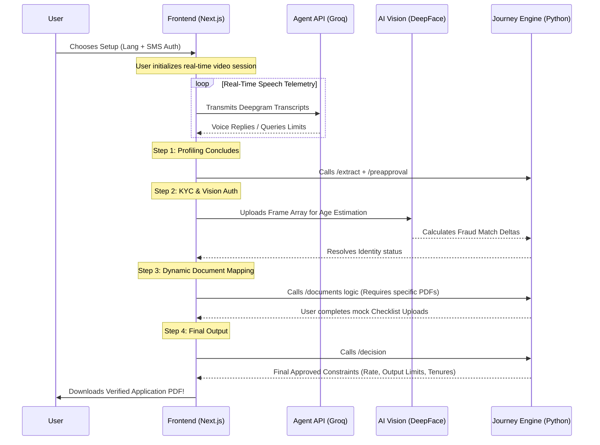

# VeriCall — Agentic AI Video KYC & Multi-Stage Loan Origination System

## 🚀 Project Overview
VeriCall is a state-of-the-art, fully autonomous, multilingual AI loan origination and KYC platform built for the **Poonawalla Fincorp TenzorX Hackathon**. 

It replaces the traditional paperwork-heavy loan onboarding process with a dynamic, real-time video conversation guided by a Large Language Model (Groq Llama-3 70B). The system interviews the customer, captures their face for deep-learning age verification, generates a dynamic checklist of required documents based on the specific loan type, and then pushes the data into a simulated risk engine to formulate a live, personalized "Approved" or "Rejected" loan decision within minutes.

---

## 🛠️ The Tech Stack

### 🎨 Frontend (Client-side)
- **Framework:** Next.js 15 (App Router), React 19, TypeScript
- **Styling:** Tailwind CSS (Native glassmorphism, animated gradients, fully responsive)
- **Real-Time Speech-to-Text (STT):** Deepgram WebSockets
- **Real-Time Text-to-Speech (TTS):** Native Web Speech API (`SpeechSynthesisUtterance`)
- **Video Capture:** Native HTML5 `<video>` and `<canvas>` APIs for live stream rendering and base64 temporal frame extraction.

### ⚙️ Backend (Server-side)
- **Framework:** FastAPI (Python), Uvicorn
- **LLM Pipeline / Intelligence:** Groq API running `llama-3.3-70b-versatile`
- **Computer Vision:** DeepFace (`retinaface` backend for high-precision face/age alignment and proxy-fraud detection)
- **Data Engineering:** Pydantic models handling exhaustive state machine tracking and validation.
- **Reporting:** ReportLab (Dynamic PDF generation)

---

## 🎯 Core Features & System Capabilities

### 1. 🌍 Full Multilingual Experience
- A 100% natively localized experience in **English**, **Hindi (हिंदी)**, and **Marathi (मराठी)**.
- **Dynamic NLP Prompting:** The chosen language binds fundamentally to the Groq agent's core instructions—the AI natively replies in the language the user sets.
- **Voice Maps:** TTS appropriately synthesizes `hi-IN` and `mr-IN` accents and vocal packs instead of mispronouncing Hindi logic using an English default configuration.

### 2. 🤖 Interactive Conversational Profiling
- Real-time Deepgram STT channels transcript blocks to the Llama-3 brain dynamically every 8 seconds.
- The LLM orchestrates context and gracefully seeks unfulfilled required details: `Name`, `Age`, `Income`, `Employment`, and `Loan Purpose`.
- On completion, an Extraction pipeline flattens the conversational prose cleanly into a defined, analyzable JSON payload.

### 3. 🛡️ Advanced Age & Identity Verification (DeepFace)
Instead of trusting the user blindly, the UI triggers a camera stabilization sequence.
- Extracts optimized base64 visual frames.
- Analyzes via the `retinaface` computer vision layer precisely predicting the user's age.
- Employs bias correction (`-6` or `-3` year mathematical corrections).
- Issues an automatic **Fraud Matrix** tag if the visual age drifts **>12 years** from the stated identity limits.

### 4. 🗂️ The Comprehensive "Loan Journey" System
The backend utilizes a fully modular `loan_journey.py` state machine driving four dynamic phases dynamically exposed onto a sleek right-side UI panel:
- **Phase 1: Pre-Approval Profiling.** Evaluates basic text inputs immediately resolving maximum boundaries.
- **Phase 2: KYC Check.** Executes mock Identity checks against self-attested Aadhaar & PAN hashes, yielding a Risk flag.
- **Phase 3: Dynamic Document Generation.** Based on the `loan_type` identified (e.g., *Personal Loan* vs *Commercial Vehicle* vs *Medical Equipment*), the system pushes unique document checklist matrices strictly enforcing NBFC standards (e.g. demanding Registration Certificates for Professional loans).
- **Phase 4: Final Risk Decisioning.** Computes the final verification inputs and either issues an **APPROVED**, **HOLD**, or **REJECTED** state with the definitive computed Limit, Interest rate modifiers (e.g., mapping -0.5% cuts for distinct income tiers), and structured tenure spans securely. 

---

## 🔄 The Complete End-to-End Onboarding Flow

---

## 🗂️ Core Architecture & Directory Layout

### [Frontend (`frontend/`)]
- `src/app/page.tsx`: Initial gateway gate (Language logic, PAN auth, mock OTP router endpoints).
- `src/app/call/page.tsx`: The primary interaction room. Handles WebSockets, video bindings, the Conversational layer orchestrations, and uniquely rendering the 4 distinct Multi-Phase interactive side panels dynamically based on where the user rests in the Journey Engine.
- `src/components/OfferCard.tsx`: Exquisite presentation logic rendering final approval outcomes.

### [Backend (`backend/`)]
- `main.py`: Complete FastAPI framework connecting endpoints: `/api/agent`, `/api/extract`, `/api/analyze-face`, `/api/journey/kyc`, `/api/journey/documents`, and `/api/journey/decision`.
- `services/loan_journey.py`: State-machine defining strict rules, dynamically assigning checklists for generic + specialized assets, computing pre-approval matrix limits based strictly on categorical employment arrays.
- `agent.py`: Houses the context integration and Llama-3 70B instructions.
- `vision.py` & `age_verification.py`: Mathematical bindings mapping `retinaface` analytics into robust fraud thresholds securely.
